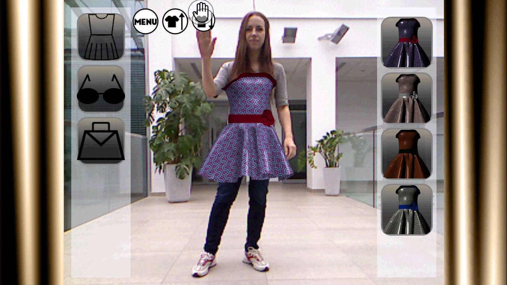

## :dress:  3D Virtual Fitting Room
Have you ever queued in a long line to a fitting room just to find out right after you put the clothes on that they don't suit you? With this application this will no longer be a problem. 3D Virtual Fitting Room lets you try on clothes right away and decide what you like the most.

### How to use
The application requires a single Kinect for Windows device being plugged in. All actions in the application can be performed by hand gestures. User's right hand is the application cursor. In order to press a button, the user needs to hold his right hand for a short time over the button area.

### Used libraries and tools
#### Kinect SDK
The application is compatible with Kinect for Windows and was written using `Microsoft.Kinect v.1.8.0.0` library. Kinect gathers different kinds of data:
* audio - that can be used for speech recognition,
* video - that is used for generating Skeleton and recognizing people,
* depth information - that inform about the depth of the captured scene. Kinect emits infrared waves with a projector that are later captured by a sensor.

The application tracks just the video data, the audio and the depth streams are not being used in this application. 

#### Helix 3D Toolkit
Helix 3D Toolkit is a great library for 3D graphics. [It's available on Github](https://github.com/helix-toolkit/helix-toolkit). The library is simple to use. The repository contains a great number of examples and demos.

### File formats
Each clothing item requires two files - obj and mtl. 

#### *.obj
Obj files define the geometry of 3D objects. It's a text file format that contains information regarding:
* vertex position,
* UV position of a texture coordinate vertex,
* vertex normals,
* faces of polygons,
* referenced materials (mtl files).

#### *.mtl
The abbreviation stands for Material Template Library. This file is a companion file format to obj files. It defines the surface shading properties. A single mtl file may contain multiple material definitions. Same as obj files, mtl files are text format files.

Materials are described using the Phong model. The file contains definition of:
* ambient color,
* diffuse color,
* specular color,
* transparency,
* texture maps (for textured materials).